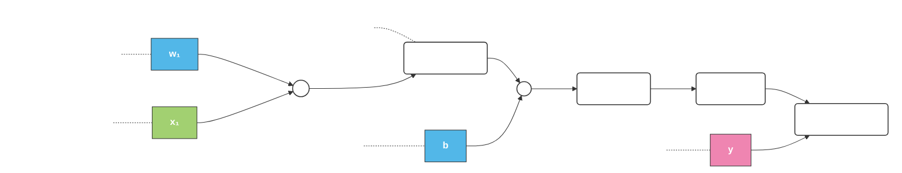

# Notes: `pytorch.py` — the DL tensor library

**Goal of this file:** learn the PyTorch fundamentals
1. Simplified attention with no trainable weights.
2. Trainable attention (scaled dot-product) using raw parameters, then `nn.Linear`.
3. Causal (masked) attention, so a token can't "see" future tokens.
4. Multi-head attention, running several attention operations in parallel.

## 1 — Installation
There are two versions of PyTorch: a leaner version that only supports CPU computing and a full version that supports both CPU and GPU computing.

```bash
pip install torch
```

Check installation:
```bash
import torch
torch.__version__
```
## 2 — Functions

### Creating tensor
```python
import torch
tensor0d = torch.tensor(1) # 0 dimensional tensor
tensor1d = torch.tensor([1, 2, 3]) #1 dimensional tensor
tensor2d = torch.tensor([[1, 2], [3, 4]]) # 2 dimensional tensor
tensor3d = torch.tensor([[[1, 2], [3, 4]], 
                        [[5, 6], [7, 8]]]) 
                        # 3 dimensional tensor

```
With this example the tensor datatype is integer(64-bit).

```python
floatvec = torch.tensor([1.0, 2.0, 3.0])
print(floatvec.dtype)
```
This will be `torch.float32`

You can change datatypes:
```python
floatvec = tensor1d.to(torch.float32)
```

### Common Operations
#### .shape

```python
tensor2d = torch.tensor([[1, 2, 3], 
                 [4, 5, 6]]) 

#prints torch.Size([2, 3])
```

#### .reshape, .view
```python
print(tensor2d.reshape(3, 2)) #reshapes the tensor
print(tensor2d.view(3, 2)) #more common way o reshape

"""
output:
tensor([[1, 2],
        [3, 4],
        [5, 6]])
"""
```

#### .transpose
```python
print(tensor2d.T)

"""
output:
tensor([[1, 4],
       [2, 5],
       [3, 6]])]
"""
```

#### .matmul
```python
print(tensor2d.matmul(tensor2d.T))
"""
output:
tensor([[14, 32],
[32, 77]]) 
"""
```

#### autograd
Allows to compute gradients in dynamic computational graphs automatically.

```python
#Logistic Regression Forward Pass
import torch.nn.functional as F

y = torch.tensor([1.0])  #true label        
x1 = torch.tensor([1.1]) #input feature  
w1 = torch.tensor([2.2]) #weight parameter
b = torch.tensor([0.0])  #bias unit
z = x1 * w1 + b          #net input      
a = torch.sigmoid(z)     #activation 
loss = F.binary_cross_entropy(a, y)
```


###  A multilayer perceptron with two hidden layers 
```python
class NeuralNetwork(torch.nn.Module):
    def __init__(self, num_inputs, num_outputs):   
super().__init__()
self.layers = torch.nn.Sequential(
    # 1st hidden layer
    torch.nn.Linear(num_inputs, 30),   
    torch.nn.ReLU(),              
    # 2nd hidden layer
    torch.nn.Linear(30, 20),   
    torch.nn.ReLU(),
    # output layer
    torch.nn.Linear(20, num_outputs),
)
    def forward(self, x):
logits = self.layers(x)
return logits 

#instantiate
model = NeuralNetwork(50, 3)

#check
print(model)

"""
output:
NeuralNetwork(
  (layers): Sequential(
    (0): Linear(in_features=50, out_features=30, bias=True)
    (1): ReLU()
    (2): Linear(in_features=30, out_features=20, bias=True)
    (3): ReLU()
    (4): Linear(in_features=20, out_features=3, bias=True)
  )
)
"""
```